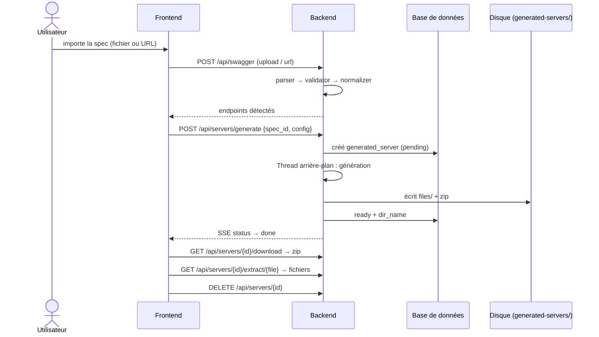
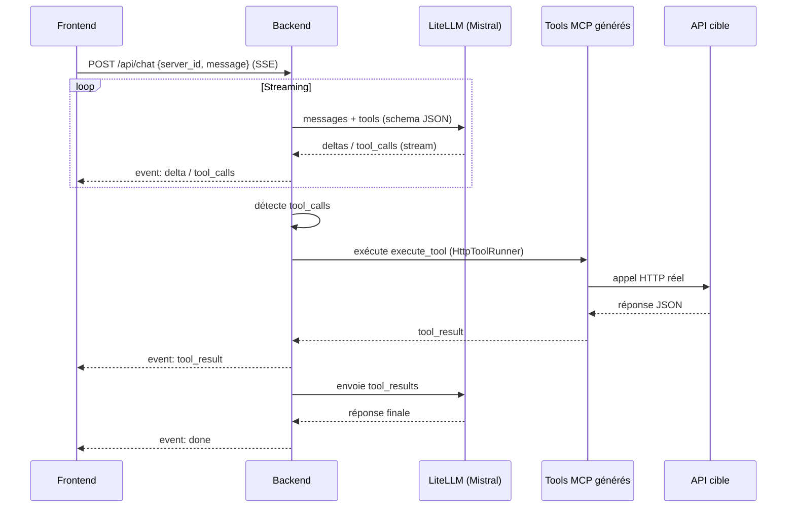

# Architecture

## Vue d'ensemble

```mermaid
flowchart LR
    subgraph Frontend [Frontend React/Vite/Tailwind]
        UP[Import spec<br/>upload / URL]
        EP[Endpoints Table<br/>filtre + sélection]
        CF[Server Config Form<br/>nom, auth, timeout]
        SL[Servers List<br/>statut en temps réel]
        PG[Chat Playground]
        ST[(Zustand store)]
    end

    subgraph Backend [Backend FastAPI]
        P[SwaggerParser<br/>détection version]
        V[SwaggerValidator<br/>openapi-spec-validator]
        N[Normalizer<br/>ParsedEndpoint]
        G[MCPGenerator<br/>Jinja2]
        PK[Packager<br/>zip]
        GC[GenerationService<br/>arrière-plan]
        CS[ChatService<br/>SSE]
    end

    subgraph DB [SQLite / Postgres]
        SM[(swagger_specs)]
        GS[(generated_servers)]
    end

    subgraph Runtime [Serveur MCP généré]
        TP[server.py<br/>stdio / streamable HTTP]
        TL[tools.py<br/>execute_tool]
        HTTP[Appels HTTP réels<br/>vers l'API cible]
    end

    subgraph LLM [LiteLLM proxy :4000]
        M[Mistral]
        O[OpenAI]
        A[Anthropic]
        LL[Ollama]
    end

    UP --> P --> V --> N
    N --> G --> PK --> GC --> GS
    GC --> TP
    GC --> TL
    TL --> HTTP
    GS --> SL
    PG --> CS --> LLM
    CS --> TL
    G --> SM
    ST --> UP
    ST --> SL
    SL -->|SSE /api/servers/{id}/status| GC
```

## Flux de génération



## Flux de chat (playground)



## Choix techniques

| Choix | Raison |
|---|---|
| `openapi-spec-validator >= 0.9.0` | Validation par version (2.0 / 3.0 / 3.1) à l'aide des validateurs dédiés |
| `prance` | Résolution `$ref` externe/interne + `resolve_remaining_refs` cyclique-safe |
| `mcp` (SDK officiel) | Serveurs MCP conformes : `stdio` + Streamable HTTP (session manager natif) |
| Jinja2 | Templates dédiés par couple (serveur, tools, requirements, Dockerfile, README, config) |
| LiteLLM proxy | Un seul contrat d'API pour Mistral/OpenAI/Anthropic/Ollama ; changement de provider = `config.yaml` |
| SSE (Server-Sent Events) | Streaming chat + statut de génération sans WebSocket |
| SQLite par défaut | Zéro dépendance ; Postgres disponible via `DATABASE_URL` et le profil `postgres` |
| Génération déterministe | Tri stable des tools, régénération idempotente (`dir_name` réutilisé) |

## Layout des serveurs générés

```
generated-servers/
└── <nom>/                    # dir_name unique
    ├── server.py             # SDK mcp : stdio + streamable HTTP
    ├── tools.py              # CONFIG, TOOLS (input_schema), execute_tool
    ├── requirements.txt
    ├── Dockerfile
    ├── README.md
    └── config.json
```

## Répertoires clés

| Répertoire | Rôle |
|---|---|
| `backend/src/mcpgen/swagger/` | parser, validator, normalizer |
| `backend/src/mcpgen/mcp_generator/` | tool_builder, templates (`.j2`), generator, packager |
| `backend/src/mcpgen/llm/` | providers + `LiteLLMClient` (streaming async) |
| `backend/src/mcpgen/services/` | swagger, generation (arrière-plan), chat (`HttpToolRunner`) |
| `backend/src/mcpgen/api/` | routes REST + SSE, dépendances, `main.py` |
| `frontend/src/` | pages, composants, services (api/ws), store Zustand |
| `litellm/` | `config.yaml` du proxy (modèles et clés) |